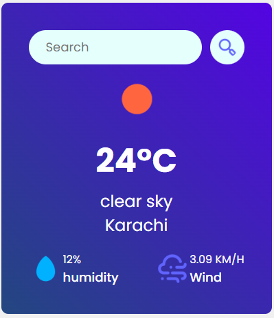

# React Weather App.

**live demo: [https://wc-react-todo-app.netlify.app/](https://wc-react-todo-app.netlify.app/)**

**Watch On Youtube: [https://youtu.be/W0Uf_xu350k](https://youtu.be/W0Uf_xu350k)**

---

### Made with ❤️ by [Shaif Arfan](https://www.instagram.com/shaifarfan08/)

Like my works and want to support me?

<a href="https://www.buymeacoffee.com/shaifarfan08" target="_blank"></a>

---

## Project Description

In the project, we will be creating a Complete Todo Application with all features. We will do all the CRUD operations. We will use `React.js` and to manage our states, we will use `Redux`. Also we will learn to make simple animations using `Framer Motion`. This will be a complete `beginner` friendly app. Hope you enjoy it.

## What we are going to learn/use

- [React](https://reactjs.org/)
- [React Redux](https://redux.js.org/)
- [Framer Motion](https://framer.com/motion/)
- [React icons](https://react-icons.netlify.com/)
- [React Hot Toast](https://react-hot-toast.com/)
- More...

## Requirements

- Basic ReactJs knowledge
- Basic HTML, CSS knowledge

## Starter files

You can find all the starter files in `starter-files` branch. You can go to the `starter-files` branch and `download zip` the starter files or You can clone the project and git checkout to `starter-files` branch.

## Getting Started

The recommended way to get started with the project is to follow the [YouTube tutorial](https://youtu.be/W0Uf_xu350k). You will find all the step-by-step guides. Or you can start the project on your own by following the guide below.

After getting the starter files, you need to go the file directory and run

```shell
npm install
```

and after that start the dev server.

```shell
npm start
```

## Tools Used

1. Favicon: [Flaticon.com](https://www.flaticon.com/)
1. Code Editor: [VS Code](https://code.visualstudio.com/)

## Other projects

📚 [All Web Cifar Project Tutorials](https://github.com/ShaifArfan/wc-project-tutorials)

---

## FAQ

### Q: How can i get started?

You can get started by following the [YouTube tutorial](https://youtu.be/W0Uf_xu350k) of this project. Here is the full tutorial video link: [coming soon].

### Q: What i need to start the project?

Just open your favorite code editor and follow along with the [YouTube tutorial](https://youtu.be/W0Uf_xu350k).

### Q: What are the prerequisites?

basics of html, css, javascript and some basic knowledge of react is enough to start this project. Rest you will learn in the tutorial.

### Q: Who the project is for?

The project is for the people who wanna get more skilled in `ReactJs`.

---

## Feedback

If you have any feedback, please reach out to us at [@web_cifar](http://instagram.com/web_cifar)

## Support

For support, join our [Community Group](http://facebook.com/groups/webcifar).

## License

[MIT](https://choosealicense.com/licenses/mit/)

Happy Coding! 🚀

# Getting Started with Create React App

This project was bootstrapped with [Create React App](https://github.com/facebook/create-react-app).

## Available Scripts

In the project directory, you can run:

### `npm start`

Runs the app in the development mode.\
Open [http://localhost:3000](http://localhost:3000) to view it in your browser.

The page will reload when you make changes.\
You may also see any lint errors in the console.

### `npm test`

Launches the test runner in the interactive watch mode.\
See the section about [running tests](https://facebook.github.io/create-react-app/docs/running-tests) for more information.

### `npm run build`

Builds the app for production to the `build` folder.\
It correctly bundles React in production mode and optimizes the build for the best performance.

The build is minified and the filenames include the hashes.\
Your app is ready to be deployed!

See the section about [deployment](https://facebook.github.io/create-react-app/docs/deployment) for more information.

### `npm run eject`

**Note: this is a one-way operation. Once you `eject`, you can't go back!**

If you aren't satisfied with the build tool and configuration choices, you can `eject` at any time. This command will remove the single build dependency from your project.

Instead, it will copy all the configuration files and the transitive dependencies (webpack, Babel, ESLint, etc) right into your project so you have full control over them. All of the commands except `eject` will still work, but they will point to the copied scripts so you can tweak them. At this point you're on your own.

You don't have to ever use `eject`. The curated feature set is suitable for small and middle deployments, and you shouldn't feel obligated to use this feature. However we understand that this tool wouldn't be useful if you couldn't customize it when you are ready for it.

## Learn More

You can learn more in the [Create React App documentation](https://facebook.github.io/create-react-app/docs/getting-started).

To learn React, check out the [React documentation](https://reactjs.org/).

### Code Splitting

This section has moved here: [https://facebook.github.io/create-react-app/docs/code-splitting](https://facebook.github.io/create-react-app/docs/code-splitting)

### Analyzing the Bundle Size

This section has moved here: [https://facebook.github.io/create-react-app/docs/analyzing-the-bundle-size](https://facebook.github.io/create-react-app/docs/analyzing-the-bundle-size)

### Making a Progressive Web App

This section has moved here: [https://facebook.github.io/create-react-app/docs/making-a-progressive-web-app](https://facebook.github.io/create-react-app/docs/making-a-progressive-web-app)

### Advanced Configuration

This section has moved here: [https://facebook.github.io/create-react-app/docs/advanced-configuration](https://facebook.github.io/create-react-app/docs/advanced-configuration)

### Deployment

This section has moved here: [https://facebook.github.io/create-react-app/docs/deployment](https://facebook.github.io/create-react-app/docs/deployment)

### `npm run build` fails to minify

This section has moved here: [https://facebook.github.io/create-react-app/docs/troubleshooting#npm-run-build-fails-to-minify](https://facebook.github.io/create-react-app/docs/troubleshooting#npm-run-build-fails-to-minify)
